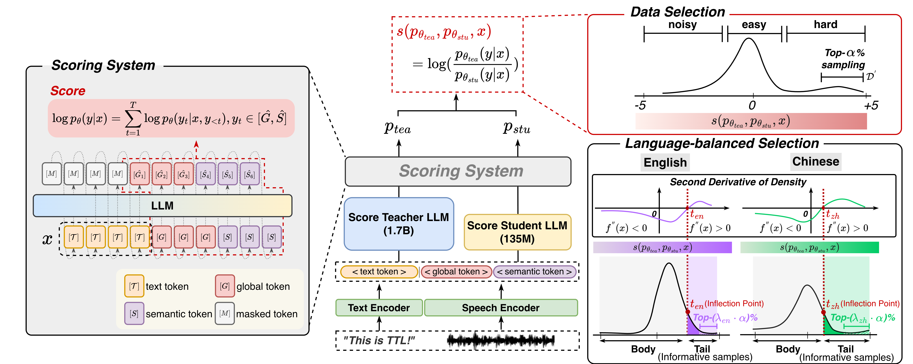

# TTL : Language-balanced Data Selection for LLM-based Text-to-Speech via Codec Token Scoring

<a href="https://ttl-cell.github.io/TTL/"></a>
</img>


## Pre-Training Corpus $\mathcal{D}$
Refer to `tools/get_dataset.py` to get the data ready. Run the following command for tokenization:
```bash
bash scripts/tools/process_data/dataset_llama.sh ./
```

## Difference Scores
```bash
bash scripts/miniplm/difference_sampling/1.7B.sh ./
bash scripts/miniplm/difference_sampling/135M.sh ./
```
Then, compute the difference scores $s(p_{\theta_{tea}},p_{\theta_{stu}},x)=\log (\frac{p_{\theta_{tea}}(y|x)}{p_{\theta_{stu}}(y|x)})$:
```bash
python scripts/miniplm/difference_sampling/compute_difference_scores_spark.py ./
```
Construct the refined pre-training corpus with the difference scores and metadata:
```bash
python scripts/miniplm/difference_sampling/construct_pretrain_data_with_metadata.py ./ 0.125 
```
